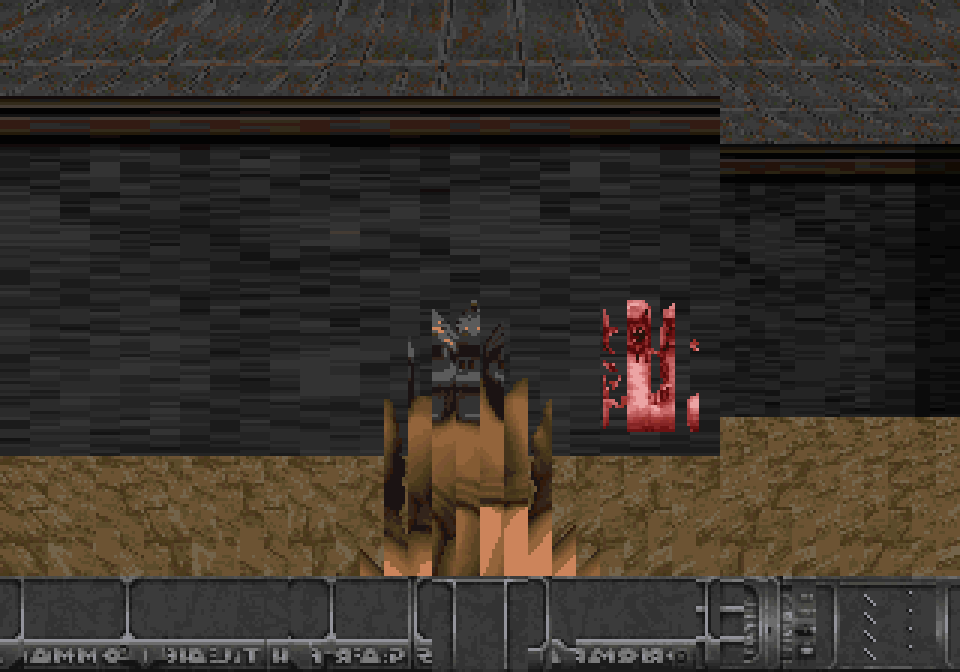

# NGRayEx

A real-time, first-person raycaster demonstration for the SNK Neo Geo AES, written
in C.

This was made purely for research purposes to understand the complexities of rendering realtime "3D"
on the Neo Geo. The code is unoptimized and could be built to run much faster. 



## How it works

Every frame, for each of 64 screen columns:

1. Cast a ray through a 2D grid map until it hits a wall.
2. Measure the perpendicular distance and turn it into a slice height
3. Write a vertical-shrink value, a Y position, and a palette into the sprite
   control block for that column's sprite.

The video chip then scales each precomposed Doom wall-texture column to the
computed height. Floor and ceiling use Doom flat textures selected from the
player-start sector and packed into preprojected sprite-strip phase banks; the
68000 swaps backdrop tile IDs as the player moves so the planes scroll without
a framebuffer span renderer. Doom pistol frames are rendered as a centered
sprite-strip overlay above the bottom 32-pixel `STBAR` status bar and animate
when B is pressed; walking and strafing nudge the pistol strips with a small
hardware-position bob so movement feels less static without adding any sprite
slots. The converter emits a compact grid-space runtime list from WAD `THINGS`;
the renderer projects up to two visible monster candidates with the same camera
math as the wall renderer while staying at the Neo Geo's
96-sprites-per-scanline ceiling in the worst case. Visible monsters are selected
before pickups so the limited sprite slots keep combat readable; candidates are
ranked by distance and screen relevance each frame, and tiny candidates hidden
under the pistol overlay are skipped. Common E1M1 monster thing types map to their own pre-scaled sprite
frames (`POSS`, `SPOS`, `TROO`, `SARG`) and live palette, and the pistol clears
the currently rendered target set as the initial combat proof of concept. The
optional minimap is drawn on the fix (text) layer, which always composites over
sprites.

All arithmetic is 16.16 . Rotation uses constant cos/sin multiplies. The whole
renderer writes only a few control words per column per frame; the expensive
pixel work is offloaded to the scaler hardware.
 
## Controls

| Input               | Action            |
|---------------------|-------------------|
| D-pad Up / Down     | Move forward/back |
| D-pad Left / Right  | Turn              |
| Hold A + Left/Right | Strafe            |
| B                   | Fire pistol       |
| C                   | Toggle minimap    |
| D                   | Open nearby door  |
| Hold A + D          | Toggle weapon     |
| D after DEAD/EXIT   | Restart level     |

Turning is tuned deliberately slower than the original raycaster demo so the
projected Doom targets can be lined up with keyboard or arcade-stick input.

The wall and sprite projection heights use the raycaster's reciprocal lookup
table instead of doing a 64-bit divide for each projected column.

Runtime WAD things now include common Doom pickups as well as monsters. Pickups
share the two projected world-sprite slots to preserve the Neo Geo scanline
budget, disappear when touched, and update live fix-layer health, ammo, and
armor counters over the Doom status bar. Clips and shells are tracked
separately, and the status bar shows compact weapon `1`/`2` digits before the
active ammo pool. Shotgun guys now drop a shotgun pickup, and collecting one
equips Doom's shotgun frames, adds shells, and makes B fire a wider spread shot
that can hit a second visible target for reduced damage. Trying to fire empty
flashes a compact fix-layer `AMMO` message instead of failing silently. Close
visible monsters apply a first-pass contact-damage tick with armor absorption.
Pickups briefly flash compact center feedback using existing fix glyphs:
`KEY`, `AMMO`, `MED`, `ARM`, or `2` for the shotgun.
Former humans, shotgun guys, and imps also apply slower ranged damage when they
are visible and close enough, so the player has pressure to move, aim, and use
doors instead of only avoiding contact. Combat uses a compact line-of-sight
sample against the converted map, so closed doors and walls block player shots,
shotgun spread targets, monster ranged damage, and monster chase wake-up. Damage
briefly tints the playfield red by swapping palettes during vblank, giving clear
feedback without spending additional sprite slots.
Monsters now keep compact per-thing hit points, so pistol shots damage targets
over multiple hits instead of deleting every visible enemy immediately; the
pistol uses a Doom-like visible-target autoaim and damages the visible monster
closest to the crosshair instead of damaging every visible target at once.
Surviving monsters flash briefly when hit, making shots readable without
spending extra sprite slots. Former humans turn into clip pickups and shotgun
guys turn into shotgun pickups when killed, reusing the existing projected
pickup path instead of adding corpse sprites. A tiny fix-layer center marker
gives the player a stable aim point without spending any sprite slots.
Runtime things now have a small mutable position layer, letting monsters take
throttled chase steps toward the player while still using the compact converted
WAD data for type, flags, and initial placement. Chase movement also keeps a
small separation radius between live monsters, which reduces stacked enemies
and makes the two projected world-sprite slots more readable. When health
reaches zero, movement and firing stop and the fix layer shows a compact `DEAD`
message; pressing D resets the player, doors, pickups, monsters, and HUD for
another run.

The converter also preserves Doom door and exit linedefs as compact runtime
trigger lists, and keycard/skull pickups set compact blue/red/yellow inventory
bits. The status bar shows compact `B`, `R`, and `Y` key indicators that brighten
when the matching key is collected. Pressing D opens nearby converted door cells,
with keyed door specials requiring the matching key, and affects both movement
and raycasting through the shared `map_at()` path. Trying a nearby keyed door
without the matching key flashes a compact fix-layer `KEY` message so the
blocked door has readable feedback. Reaching the converted E1M1 exit cell now
raises a fix-layer `EXIT` message and freezes player control, monster movement,
and monster damage until D restarts the level. This keeps level progression
behavior in the ROM without keeping generic WAD directory/lump metadata in the
cartridge.

## Building

The `doom-neogeo-port` branch expects a local ngdevkit/GnGeo install under
`.tools/ngdevkit-local`; `.tools/` is ignored by git so the toolchain and WAD
downloads stay repo-local without being committed.
 

```sh
# graphics + sound ROMs (self-contained tile encoder)
python3 tools/gen_gfx.py

# compile, convert Freedoom E1M1, and assemble the cartridge
make

# run with the local GnGeo and known-good keyboard mapping
SDL_VIDEODRIVER=x11 make gngeo
```

`tools/gen_gfx.py` emits the C/S/M/V ROMs directly in the Neo Geo's planar
format, so the only ngdevkit dependency is the m68k toolchain. See the comments
at the top of each tool for details.

`tools/doom_convert.py` reads a Doom-format WAD at build time and emits a compact
grid header for the Neo Geo raycaster. By default, `make` downloads Freedoom
0.13.0 into `.tools/assets/` and converts `E1M1`:

```sh
make DOOM_MAP=E1M2
make DOOM_MAP=E1M1 DOOM_MAP_WIDTH=38 DOOM_MAP_HEIGHT=27
```

This is intentionally build-time WAD compatibility: the cartridge contains the
converted map data, not a runtime WAD loader.

For visual regression work, run the native Doom comparison capture:

```sh
DOOM_MAP=E1M1 tools/capture_compare.sh
```

The script launches native Doom with the same Freedoom WAD, launches GnGeo with
the current ROM, and writes native/Neo Geo/side-by-side screenshots under
`.tools/screens/`.
 
You must supply your own Neo Geo BIOS — it is copyrighted and not included.

I've only tested this with [gngeo](https://github.com/dciabrin/gngeo) It may not render correctly on real hardware
 
## Acknowledgements

Built against the [ngdevkit](https://github.com/dciabrin/ngdevkit) toolchain.
Hardware details cross-referenced from the
[Neo Geo Development Wiki](https://wiki.neogeodev.org).  
